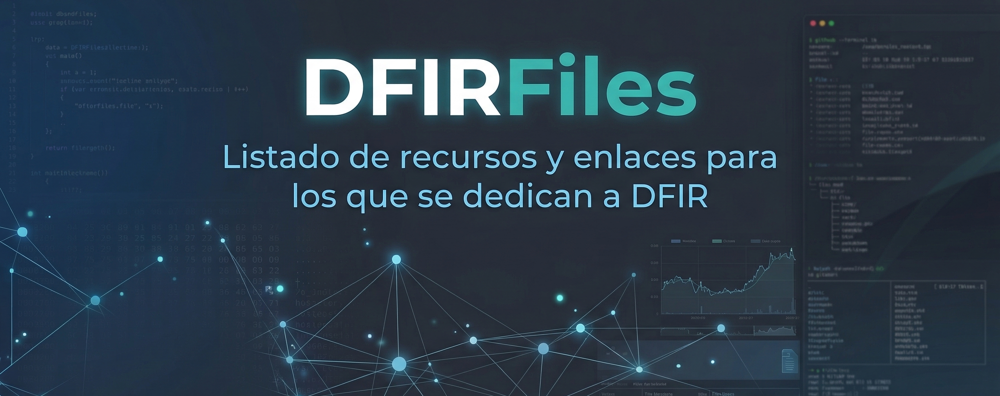

# Index
## DFIR
* Herramientas para DFIR: [DFIRTools](https://github.com/jodarb/DFIRfiles/blob/main/DFIRTools.md)
* Docs y referencias para DFIR: [DFIRDocs](https://github.com/jodarb/DFIRfiles/blob/main/DFIRDocs.md)

## Formación
* Listado de formaciones y plataformas para aprender ciberseguridad: [Learning](https://github.com/jodarb/DFIRfiles/blob/main/Learning.md)
* CTFs de desarrollo propio y recopilado: [CTFs](https://github.com/jodarb/DFIRfiles/blob/main/CTFs.md)
* CTFs DFIR públicos: [DFIRCTFs](https://github.com/jodarb/DFIRfiles/blob/main/DFIRCTFs.md)
